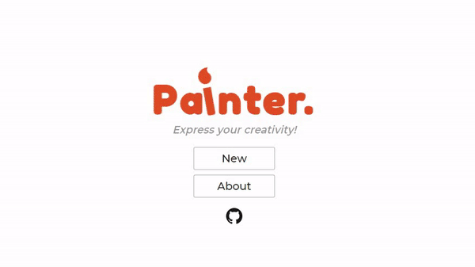

# Painter

[](https://gitter.im/Painter_KWOC/community?utm_source=badge&utm_medium=badge&utm_campaign=pr-badge&utm_content=badge)

Painter is a canvas painting web app, where you can draw and express your creativity, and download your painting.
Live Version : [Painter](https://iamskab.github.io/Painter)
[](https://iamskab.github.io/Painter/)


## 🚀&nbsp; Installation
1. Fork the repo ( `Fork` option in the right corner)
2. Clone the repo
```
$ git clone https://github.com/USER_NAME/Painter.git
```

3. Change your directory to the cloned repo and install all the node modules
```
$ npm install 
```

4. The directory `build` contains the entire app (all the rest is for development). So, just open the following url in your browser,
```
$ http://127.0.0.1:5500/build/
```

## Technologies used:
- HTML 5
- SCSS
- JavaScript(ES6+)
- Parcel

## :clap: And it's done!
Feel free to mail me for any doubts/query 
:email: iamsourav470@gmail.com

## :handshake: Contribution
Feel free to **file a new issue** with a respective title and description on the the [Painter](https://github.com/iamskab/Painter/issues) repository. If you already found a solution to your problem, **I would love to review your pull request**! 
